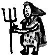
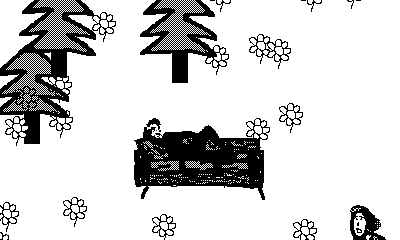

# Kolya vs Babushkas



Small game I made for my friend Kolya. In the game Kolya is riding his sofa and fights against grannies (*babushkas*) by throwing Nintendo Switch controllers at them.

My first attempt at programming for Playdate. The game art is made by Asya.

## How it looks?



## Install and run

Install [Playdate SDK](https://play.date/dev/) and run:

```bash
git submodule update --init # for Playdate-LuaCATS
make
```

## Developer experience

I use [Lua Language Server](https://marketplace.visualstudio.com/items?itemName=sumneko.lua) with VSCode. [Playdate-LuaCATS](https://github.com/notpeter/playdate-luacats) is included as a git submodule for the full autocomplete on Playdate SDK functions.